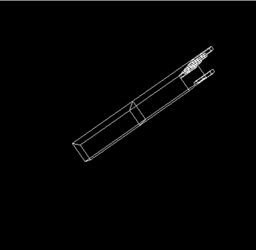

## maryem galal , sec :2 , bn:24

 The Arm: contains 4 parts shoulder, elbow, fingersbases and the upper part of the finger. 

<center></center>

defining the variables 
```cpp
static int shoulder = 0, elbow = 0, fingerBase1 = 0, fingerUp1 = 0, fingerBase2 = 0, fingerUp2 = 0, fingerBase3 = 0, fingerUp3 = 0, fingerBase4 = 0, fingerUp4 = 0, fingerBase5 = 0, fingerUp5 = 0;
int moving, startx, starty;

GLfloat angle = 0.0;   
GLfloat angle2 = 0.0;   
```
 1-shoulder :drawing the shoulder by drawing a 1cm cube then multiply its x and y 1cm components by 2.0 and .6 then translate it into -ve x-axix by 1 unit </br>
 2- the elbow : same as shoulder but by translating the cube(after rescal it) into +ve x-axis by 1 unit</br>

```cpp
    glPushMatrix();
    glRotatef(angle2, 1.0, 0.0, 0.0);
    glRotatef(angle, 0.0, 1.0, 0.0);
    glTranslatef(-1.0, 0.0, 0.0);
    glRotatef((GLfloat)shoulder, 0.0, 0.0, 1.0);
    glTranslatef(1.0, 0.0, 0.0);
    glPushMatrix();
    glScalef(2.0, 0.6, 1.0);
    glutWireCube(1.0);
    glPopMatrix();
    glTranslatef(1.0, 0.0, 0.0);
    glRotatef((GLfloat)elbow, 0.0, 0.0, 1.0);
    glTranslatef(1.0, 0.0, 0.0);
    glPushMatrix();
    glScalef(2.0, .6, 1.0);
    glutWireCube(1.0);
    glPopMatrix();
}
```
<center></center>
<center></center>

 3-fingersbases : by firtly drawing cube in orgin and rescal it  by multipling its 3 component by 0.3, 0.1, 0.15 and translate first finger to .25 in -ve y-axis and the other 4 fingers to .25 in +ve y-axis

```cpp
//Draw finger base 1
    glPushMatrix();
    glTranslatef(1.0, 0.0, 0.0);
    glRotatef((GLfloat)fingerBase1, 0.0, 0.0, 1.0);
    glTranslatef(0.15, -0.25, 0.0);
    glPushMatrix();
    glScalef(0.3, 0.1, 0.15);
    glutWireCube(1);
    glPopMatrix();

//Draw finger base 2 
    glPushMatrix();
    glTranslatef(1.0, 0.0, 0.0);
    glRotatef((GLfloat)fingerBase2, 0.0, 0.0, 1.0);
    glTranslatef(0.15, 0.25, 0.45);
    glPushMatrix();
    glScalef(0.3, 0.1, 0.1);
    glutWireCube(1);
    glPopMatrix();
```
 4- upper parts of the fingers : same as fingerbases but then tranlate them( after the finger bases ) by .15  in x-axix

```cpp
//Draw finger base 1 
    glPushMatrix();
    glTranslatef(1.0, 0.0, 0.0);
    glRotatef((GLfloat)fingerBase1, 0.0, 0.0, 1.0);
    glTranslatef(0.15, -0.25, 0.0);
    glPushMatrix();
    glScalef(0.3, 0.1, 0.15);
    glutWireCube(1);
    glPopMatrix();
 ```
<center></center>

## rotation   
 1-soulder :it can rotate up to 90ْ° and down to -90</BR>
 2-elbow : it can rotate up to 150° and down to 0</BR>
 3-fingerbases : first finger can rotate up to 90° and down to 0, the other 4 can rotate up to 90 and down to -90°</br>
 4-upperparts of fingers : first finger can rotate down to -90 and up to 0, other figers can rotate up to 90° and down to -90° 

```cpp
switch (key)
    {
    case 's':
        if (shoulder < 90)
        {
            shoulder = (shoulder + 5) ;
            glutPostRedisplay();
        }
        break;
    case 'S':
        if (shoulder > -90)
        {
            shoulder = (shoulder - 5) ;
            glutPostRedisplay();
        }
        break;
    
    case 'e':
    if (elbow < 130)
    {
        elbow = (elbow + 5) ;
        glutPostRedisplay();
    }
        break;
    
    case 'E':
        if (elbow > 0)
        {
            elbow = (elbow - 5);
            glutPostRedisplay();
        }
        break;

    case 'f':
        if (fingerBase1 < 90) {
            fingerBase1 = (fingerBase1 + 5) ;
            glutPostRedisplay();
        }
        break;
    case 'F':
        if (fingerBase1 > 0) {
            fingerBase1 = (fingerBase1 - 5) ;
            glutPostRedisplay();
        }
        break;
    case 'g':
        if (fingerUp1 < 90) {
            fingerUp1 = (fingerUp1 + 5);
            glutPostRedisplay();
        }
        break;
    case 'G':
        if (fingerUp1 > 0) {
            fingerUp1 = (fingerUp1 - 5);
            glutPostRedisplay();
        }
        break;
    case 'h':
        if (fingerBase2 < 90) {
            fingerBase2 = (fingerBase2 + 5);
            glutPostRedisplay();
        }
        break;
    case 'H':
        if (fingerBase2 > -90) {
            fingerBase2 = (fingerBase2 - 5);
            glutPostRedisplay();
        }
        break;
    case 'j':
        if (fingerUp2 < 0) {
            fingerUp2 = (fingerUp2 + 5);
            glutPostRedisplay();
        }
        break;
    case 'J':
        if (fingerUp2 > -90) {
            fingerUp2 = (fingerUp2 - 5);
            glutPostRedisplay();
        }
        break;
    case 'k':
        if (fingerBase3 < 90) {
            fingerBase3 = (fingerBase3 + 5);
            glutPostRedisplay();
        }
        break;
    case 'K':
        if (fingerBase3 > -90) {
            fingerBase3 = (fingerBase3 - 5);
            glutPostRedisplay();
        }
        break;
    case 'l':
        if (fingerUp3 < 0) {
            fingerUp3 = (fingerUp3 + 5);
            glutPostRedisplay();
        }
        break;
    case 'L':
        if (fingerUp3 > -90) {
            fingerUp3 = (fingerUp3 - 5);
            glutPostRedisplay();
        }
        break;
    case 'z':
        if (fingerBase4 < 90) {
            fingerBase4 = (fingerBase4 + 5);
            glutPostRedisplay();
        }
        break;
    case 'Z':
        if (fingerBase4 > -90) {
            fingerBase4 = (fingerBase4 - 5);
            glutPostRedisplay();
        }
        break;
    case 'x':
        if (fingerUp4 < 0) {
            fingerUp4 = (fingerUp4 + 5);
            glutPostRedisplay();
        }
        break;
    case 'X':
        if (fingerUp4 > -90) {
            fingerUp4 = (fingerUp4 - 5);
            glutPostRedisplay();
        }
        break;
    case 'c':
        if (fingerBase5 < 90) {
            fingerBase5 = (fingerBase5 + 5);
            glutPostRedisplay();
        }
        break;
    case 'C':
        if (fingerBase5 > -90) {
            fingerBase5 = (fingerBase5 - 5);
            glutPostRedisplay();
        }
        break;
    case 'v':
        if (fingerUp5 < 0) {
            fingerUp5 = (fingerUp5 + 5);
            glutPostRedisplay();
        }
        break;
    case 'V':
        if (fingerUp5 > -90) {
            fingerUp5 = (fingerUp5 - 5);
            glutPostRedisplay();
        }
        break;
    case 27:
        exit(0);
        break;
    default:
        break;
    }
    ```